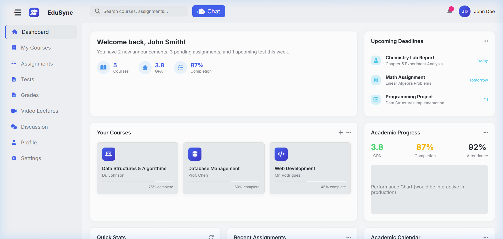
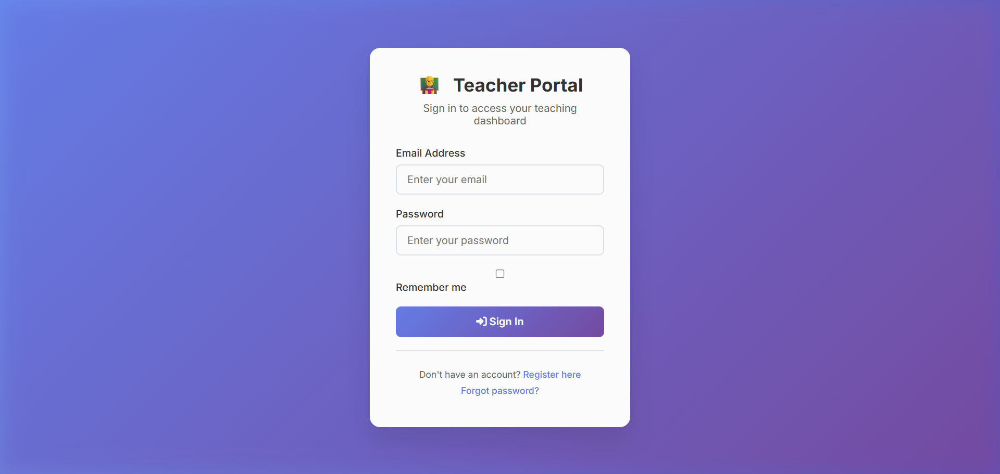
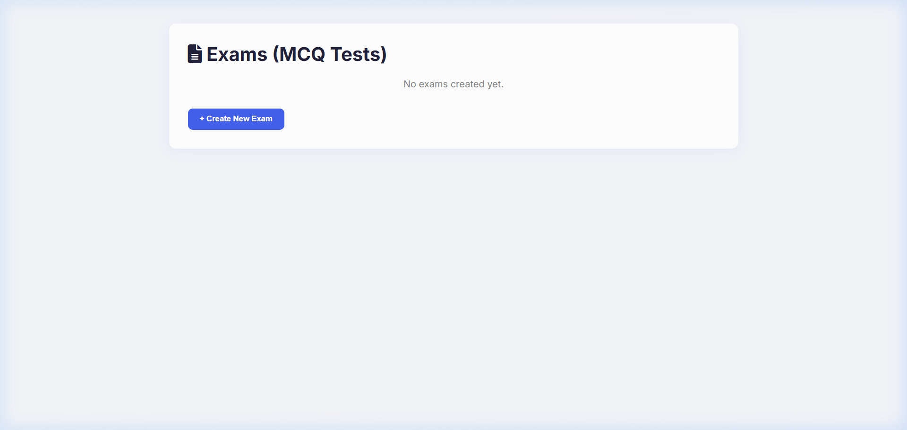
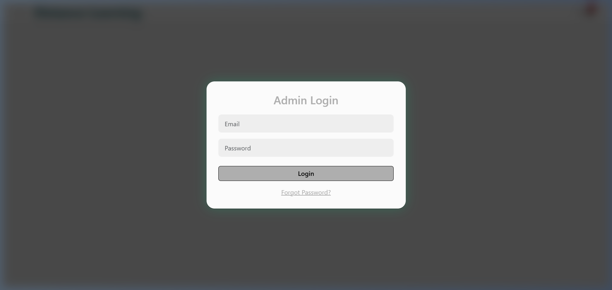

# EduSync Learning Management System

A full-stack, modular Learning Management System (LMS) designed as a student portfolio project to demonstrate frontend interface design, portal-based routing, and backend API integration.

## Project Overview

EduSync is an educational platform designed to connect students, teachers, and administrators through dedicated, role-specific portals. This project serves as a practical exploration of full-stack web development, addressing the structural challenges of building multi-user dashboards, managing UI consistency, and interacting with a Node.js/MongoDB backend. 

## Key Features

### Student Portal
- **Dashboard:** At-a-glance view of enrolled courses, upcoming assignments, and performance metrics.
- **Tests Module:** A dedicated interface for taking assessments and quizzes.
- **Responsive Layout:** A CSS Grid-based layout that gracefully scales down to mobile devices, ensuring accessibility.

### Teacher Portal
- **Dashboard:** A centralized hub for managing courses, grading, and monitoring student participation.
- **Exams Module:** A standalone interactive module for creating, editing, and managing multiple-choice exams.
- **Data Persistence:** The teacher portal includes functional integration with the backend API (`/courses` and `/exams`) to manage educational content.

### Admin Portal
- **Management Interface:** A comprehensive dashboard for overseeing the entire platform, including user metrics and system settings.
- **Data Visualization:** Integrated charting to display simulated analytics and user engagement.

### Backend
- **Express API:** A lightweight RESTful API built with Node.js and Express.
- **MongoDB Integration:** Configured with Mongoose for data persistence and schemas.

## Technology Stack

| Category | Technologies |
|---|---|
| **Frontend UI** | HTML5, CSS3, JavaScript (ES6) |
| **Styling & Icons** | Vanilla CSS, Bootstrap 5 (Admin), Font Awesome, Bootstrap Icons |
| **Backend** | Node.js, Express.js |
| **Database** | MongoDB, Mongoose |
| **Libraries** | Chart.js, Axios, dotenv |

## Project Structure

```text
learning-management-system/
├── BACKEND/
│   ├── server.js              # Express API & Database connection
│   ├── package.json           # Node dependencies
│   ├── package-lock.json
│   ├── .env.example           # Environment configuration template
│   └── README.md
├── FRONTEND/
│   ├── admin/
│   │   └── index.html         # Admin dashboard overlay
│   ├── student/
│   │   ├── login.html         # Student authentication interface
│   │   ├── student.html       # Student dashboard and LMS view
│   │   └── test.html          # Student assessment interface
│   └── teacher/
│       ├── exams.html         # Teacher exam creator/manager
│       └── teacher.html       # Teacher dashboard
└── .gitignore
```

## Setup / Running Locally

### Backend Setup

1. Open a terminal and navigate to the backend directory:
   ```bash
   cd BACKEND
   ```
2. Install the required Node dependencies:
   ```bash
   npm install
   ```
3. Configure your environment variables:
   * Copy the `.env.example` file and rename it to `.env`.
   * Open `.env` and add your MongoDB connection string to the `MONGODB_URI` variable. **Never commit your `.env` file or expose real credentials.**
4. Start the server:
   ```bash
   npm start
   ```

### Frontend Setup

The frontend consists of static files. To avoid CORS issues and ensure routing works properly, serve the `FRONTEND` directory using a simple local web server. 

For example, using Python:
```bash
cd FRONTEND
python -m http.server 8000
```
Then, open your browser and navigate to the portals (e.g., `http://localhost:8000/student/login.html`).

## Important Project Status & Limitations

* **Portfolio Focus:** This project is primarily a student portfolio piece demonstrating frontend portal design, backend API structuring, and UI/UX workflows. It is not intended to be a production-ready or enterprise-grade application.
* **Mocked Data:** While the Express/Mongoose backend is fully functional, certain portals (specifically the Student and Admin dashboards) currently utilize mocked data, hardcoded DOM elements, or `localStorage` to demonstrate the user interface without requiring a fully synchronized database. 
* **Backend Connectivity:** The MongoDB connection relies on the user providing a valid external database URI. The existing code handles the connection gracefully, but full data synchronization across all three portals is not yet implemented.
* **Security:** The current authentication flow (email/password matching) is simplified for demonstration purposes and does not utilize JWTs, bcrypt, or secure session management. 

## Team & My Contribution

This LMS was developed collaboratively by a team of 5 students.

As the **Team Lead**, my core contributions included:
- **Project Coordination:** Directing the efforts of 4 teammates to ensure cohesive progress.
- **Integration & Debugging:** Bridging the gap between frontend interfaces and backend APIs.
- **Codebase Refinement:** Leading a comprehensive technical audit and cleanup phase, which included unifying visual themes, fixing critical mobile responsiveness issues, resolving broken navigation flows, and securing the backend configuration.
- **Full-Stack Development:** Assisting across both the Node.js backend logic and the CSS/JS frontend layout structures.

## Project Experience & Recognition

The collaborative effort and technical execution of this LMS resulted in our group receiving a "Best Team" recognition during our academic project showcase, highlighting our effective teamwork and project management.

## Screenshots

* **Student Portal**
  
* **Teacher Portal**
  
* **Exams Module**
  
* **Admin Dashboard**
  

## Design & Engineering Notes

- **Consistent Visual System:** The portals utilize a unified color palette and typography system (Inter font) implemented via global CSS variables.
- **Responsive Layouts:** CSS Grid is heavily leveraged to create dashboards that gracefully collapse from 3-column desktop views to single-column mobile views.
- **Modular Organization:** The repository cleanly separates concerns, keeping role-specific frontend assets isolated and backend logic encapsulated in its own directory.
- **Environment Configuration:** Database credentials are securely abstracted into environment variables via `dotenv`, preventing accidental credential leaks.

## Future Improvements

- Connect the Student and Admin dashboards to persistent backend data to eliminate mocked arrays.
- Implement robust authentication and authorization using JWTs and password hashing.
- Expand the REST API to support deeper integration for analytics and grading workflows.

## Learning Outcomes

Building this LMS served as a highly practical learning experience, demonstrating:
- The fundamentals of full-stack development using Node.js and vanilla frontend technologies.
- How to structure and consume RESTful APIs with Express and Mongoose.
- The complexities of designing role-based user interfaces and maintaining visual consistency across disparate portals.
- The realities of iterative refinement, debugging, and securing an existing codebase.
- Effective team coordination and project leadership.

## Closing

EduSync represents a foundational milestone in full-stack web development. It successfully encapsulates the core challenges of building multi-user platforms and serves as a strong stepping stone toward mastering more complex, scalable software architectures.
